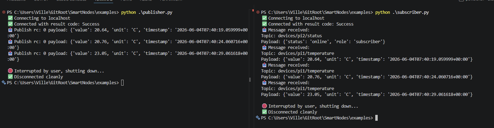

## Handling database (node-vault)

1. Creating node-vault container
```bash
docker compose up -d --build node-vault
```

2. Connecting to the Database
```bash
docker exec -it node-vault psql -U vault_dbuser -d vault_db
```

3. Checking if the tables exists
```bash
vault_db=# \dt
            List of relations
 Schema |   Name   | Type  |    Owner
--------+----------+-------+--------------
 public | devices  | table | vault_dbuser
 public | messages | table | vault_dbuser
(2 rows)

vault_db=#
```

4. Verifying the tables content
```bash
vault_db=# SELECT * FROM devices;
 id | created_at | device_id | device_name | api_key | role | ip_address | location | last_seen
----+------------+------------+-------------+---------+------+------------+----------+-----------
(0 rows)

vault_db=# SELECT * FROM messages;
 id | recorded_at | device_timestamp | device_id | topic | payload | qos | retain
----+-------------+------------------+-----------+-------+---------+-----+--------
(0 rows)

vault_db=#
```

5. Deleting Content (Optional)
```bash
vault_db=# DELETE FROM devices;
DELETE 0
vault_db=# DELETE FROM messages;
DELETE 0
vault_db=#
```

6. Closing the database connection
```bash
vault_db=# \q
```

7. Stopping and starting the database (Optional)

```bash
docker compose stop node-vault
```

```bash
docker compose start node-vault
```

8. Logging the database (Optional)

```bash
docker logs node-vault -f
```

9. Connecting the database container (Optional)

```bash
docker exec -it node-vault /bin/bash
```

10. Deleting the database (Optional)

```bash
docker compose down node-vault -v
```

Use `-v` only if you are OK with **losing all PostgreSQL data** for this project.


## Handling MQTT broker (node-hub)

1. Creating node-hub container (broker)
```bash
docker compose up -d --build node-hub
```

2. Connecting to the broker (subscribe)
```bash
cd examples
python .\subscriber.py
```

3. Connecting to the broker (publish)
```bash
cd examples
python .\publisher.py
```



4. Stopping and starting the broker (Optional)

```bash
docker compose stop node-hub
```

```bash
docker compose start node-hub
```

5. Logging the broker (Optional)

```bash
docker logs node-hub -f
```

6. Connecting the broker container (Optional)

```bash
docker exec -it node-hub /bin/sh
```

7. Deleting the broker (Optional)

```bash
docker compose down node-hub -v
```

## Handling ingestor (node-ingest)

1. Creating node-ingest container (ingestor)
```bash
docker compose up -d --build node-ingest
```

2. Stopping and starting the ingestor (Optional)

```bash
docker compose stop node-ingest
```

```bash
docker compose start node-ingest
```

5. Logging the ingestor (Optional)

```bash
docker logs node-ingest -f
```

6. Connecting the ingestor container (Optional)

```bash
docker exec -it node-ingest /bin/bash
```

7. Updating the ingestor (Optional)

```bash
docker compose up -d --build node-ingest
```

8. Deleting the ingestor (Optional)

```bash
docker compose down node-ingest -v
```