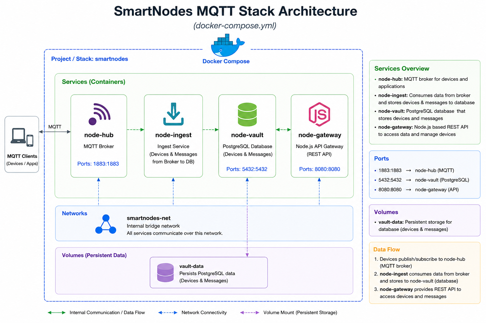

# 🚀 SmartNodes – Intelligent MQTT Device Platform

## 🌐 Overview

SmartNodes is a lightweight, scalable, and modular MQTT-based IoT platform designed for intelligent device communication, real-time telemetry collection, and centralized device management.

**Built with Docker Compose and modern containerized microservices, SmartNodes provides a clean and production-ready architecture for:**

* Connecting edge devices
* Collecting telemetry messages
* Storing device and sensor data
* Exposing REST APIs for applications and integrations
* Enabling real-time communication across distributed systems

The platform is ideal for:

* Industrial IoT
* Smart buildings
* Environmental monitoring
* Edge computing
* Educational IoT laboratories
* Prototype and production MQTT infrastructures

SmartNodes emphasizes:

* Simplicity
* Scalability
* Reliability
* Clean architecture
* Service separation

Each service has a dedicated responsibility, making the stack easy to maintain, extend, and deploy.

---

## 🧩 Architecture Philosophy

The SmartNodes stack follows a service-oriented architecture where every container has a clear and isolated responsibility. The platform is divided into four core services:

| Service         | Responsibility                   |
| --------------- | -------------------------------- |
| 📡 node-hub     | MQTT communication broker        |
| 📥 node-ingest  | Message ingestion and processing |
| 🗄️ node-vault  | Persistent database storage      |
| 🔌 node-gateway | REST API and external access     |

This architecture improves:

* Security
* Performance
* Scalability
* Maintainability
* Development speed

---

## 🖼️ Architecture diagram



---

## ⚙️ Core Services

### 📡 node-hub – MQTT Broker

**🎯 Purpose**

`node-hub` acts as the central communication hub of the platform. All IoT devices, sensors, applications, and edge systems connect to this service using the MQTT protocol.

---

**🔧 Responsibilities**

* Accept MQTT client connections
* Handle publish/subscribe messaging
* Route device messages
* Manage MQTT topics
* Enable real-time communication

---

**💡 Why It Matters**

MQTT is lightweight and optimized for low-bandwidth and resource-constrained environments. The broker enables:

* Fast telemetry transmission
* Near real-time communication
* Efficient device synchronization
* Low network overhead

---

**🧪 Example Use Cases**

* Raspberry Pi telemetry
* Environmental sensors
* Smart home devices
* Industrial monitoring systems
* Edge AI gateways

---

**🔌 Default Port**

* MQTT: `1883`

---

### 📥 node-ingest – Data Ingestion Service

**🎯 Purpose**

`node-ingest` listens to MQTT traffic from `node-hub` and transforms raw device communication into structured database records. This service acts as the bridge between MQTT messaging and persistent storage.

---

**🔧 Responsibilities**

* Subscribe to MQTT topics
* Consume telemetry data
* Parse incoming payloads
* Validate message structures
* Store devices and messages into the database
* Handle ingestion workflows

---

**💡 Why It Matters**

Separating ingestion logic from the broker improves flexibility and scalability. Benefits include:

* Cleaner architecture
* Easier data validation
* Independent scaling
* Better fault isolation
* Future analytics support

---

**🔄 Typical Workflow**

1. Device publishes telemetry to MQTT broker
2. `node-ingest` receives the message
3. Payload is validated
4. Data is transformed if necessary
5. Information is stored into PostgreSQL

---

### 🗄️ node-vault – Persistent Data Storage

**🎯 Purpose**

`node-vault` is the persistent storage layer of the SmartNodes platform. It stores:

* Registered devices
* Telemetry messages
* Device metadata
* Historical records
* API-accessible data

---

**🧰 Technology**

The service uses PostgreSQL for reliable relational data management.

---

**🔧 Responsibilities**

* Store device information
* Persist incoming messages
* Enable historical analytics
* Support API queries
* Maintain data integrity

---

**💡 Why It Matters**

Persistent storage enables:

* Historical analysis
* Trend monitoring
* Reporting
* Dashboard integrations
* Long-term telemetry retention

---

**🏆 Benefits of PostgreSQL**

* ACID compliance
* High reliability
* Strong indexing support
* Excellent scalability
* Mature ecosystem

---

**🔌 Default Port**

* PostgreSQL: `5432`

---

### 🔌 node-gateway – REST API Gateway

**🎯 Purpose**

`node-gateway` exposes platform functionality through a modern REST API. This service allows external applications, dashboards, mobile apps, and administrators to interact with SmartNodes without direct database access.

---

**🔧 Responsibilities**

* Expose REST endpoints
* Provide device management
* Return telemetry data
* Handle API authentication
* Abstract internal architecture
* Enable third-party integrations

---

**💡 Why It Matters**

The gateway creates a secure and controlled interface between internal services and external systems. This enables:

* Web dashboards
* Mobile applications
* Third-party integrations
* Administrative tooling
* Monitoring systems

---

**🧪 Example API Features**

* List devices
* Read latest telemetry
* Register new devices
* Search historical messages
* Health monitoring endpoints

---

**🧰 Technology**

* Node.js-based API service

---

**🔌 Default Port**

* REST API: `8080`

---

## 🔄 Internal Data Flow

The SmartNodes platform follows a clean and modular telemetry pipeline.

### 📡 Device Communication Flow

```text id="flow1"
Devices / Sensors
        ↓
    node-hub
    (MQTT Broker)
        ↓
   node-ingest
(Message Processing)
        ↓
   node-vault
(PostgreSQL Storage)
        ↓
  node-gateway
   (REST API)
        ↓
 Applications / Dashboards
```

---

## 🌐 Network Architecture

All services communicate through an isolated internal Docker bridge network.

**✅ Benefits**

* Service isolation
* Simplified deployment
* Internal DNS resolution
* Improved security
* Easy scalability

Containers communicate internally using service names instead of fixed IP addresses.

**Example**

```text id="flow2"
node-gateway → node-vault
node-ingest → node-hub
```

---

## 💾 Persistent Storage

The platform uses Docker volumes to ensure data persistence.

### 📦 vault-data

Persistent Docker volume used by PostgreSQL. This ensures:

* Database survives container restarts
* Device data remains persistent
* Telemetry history is preserved
* Backups are easier to manage

---

## 🌟 Key Advantages

### 🧩 Modular Design

Each service can be independently:

* Updated
* Restarted
* Scaled
* Replaced

---

### 🐳 Containerized Deployment

Docker Compose enables:

* Fast deployment
* Environment consistency
* Simplified maintenance
* Easy onboarding

---

### 📈 Scalable Architecture

The platform supports future expansion such as:

* Authentication services
* HTTPS reverse proxies
* Device provisioning
* Web dashboards
* AI analytics
* Kafka integrations
* Edge synchronization
* Monitoring stacks

---

### ⚡ Real-Time Messaging

MQTT enables efficient communication for:

* Sensors
* Industrial devices
* Mobile systems
* Embedded systems
* Edge computing

---

## 🏭 Typical Deployment Scenarios

### 🏠 Smart Buildings

* Temperature sensors
* Energy monitoring
* HVAC automation
* Access control systems

---

### 🏭 Industrial Monitoring

* Machine telemetry
* Predictive maintenance
* Sensor analytics
* Production monitoring

---

### 🎓 Educational IoT Laboratories

* MQTT demonstrations
* Docker architecture training
* Database integration exercises
* API development practice

---

## 🧠 Summary

SmartNodes provides a modern, extensible, and production-ready MQTT infrastructure for intelligent devices and IoT systems. By separating communication, ingestion, storage, and API access into dedicated services, the platform achieves:

* Real-time communication
* Scalability
* Reliability
* Clean architecture
* Maintainability

The stack is lightweight enough for development environments while remaining powerful enough for production-grade IoT deployments.

---

# ⚙️ Installation

Clone the repository and start all containers together:

```bash
git clone https://github.com/vheikkiniemi/SmartNodes
cd SmartNodes
cp .env.exampel .env # Modify the variable values to your own.
docker compose up -d --build
```

Stop and remove stack
```bash
docker compose down --volumes
```

> [!NOTE]
> A recommended method is to bring up each container individually. This simplifies both deployment and potential error situations. Additionally, it is an excellent approach from a learning perspective.

---

# 🗄️ Handling Database Service (`node-vault`)

The `node-vault` service is the persistent PostgreSQL database of the SmartNodes platform. It stores:

* Registered devices
* Telemetry messages
* Device metadata
* Historical MQTT data

---

## 🚀 Creating the `node-vault` Container

Build and start the PostgreSQL database container:

```bash
docker compose up -d --build node-vault
```

---

## 🔌 Connecting to the Database

Connect to PostgreSQL using the interactive `psql` terminal:

```bash
docker exec -it node-vault psql -U vault_dbuser -d vault_db
```

**Alternative (Recommended)**

Expanded output and disabled pager improve readability:

```bash
docker exec -it node-vault psql -U vault_dbuser -d vault_db -P pager=off -P expanded=on
```

---

## 📋 Checking Existing Tables

Verify that the required tables were created successfully:

```bash
vault_db=# \dt
```

Expected output:

```text
            List of relations
 Schema |   Name   | Type  |    Owner
--------+----------+-------+--------------
 public | devices  | table | vault_dbuser
 public | messages | table | vault_dbuser
(2 rows)
```

---

## 🔍 Verifying Table Contents

Check whether the database contains devices and messages:

**Devices Table**

```bash
vault_db=# SELECT * FROM devices;
```

Example output:

```text
 id | created_at | device_uid | device_name | api_key | role | ip_address | location | last_seen | is_connected | disconnected_at
----+------------+------------+-------------+---------+------+------------+----------+-----------+--------------+------------------
(0 rows)
```

**Messages Table**

```bash
vault_db=# SELECT * FROM messages;
```

Example output:

```text
 id | recorded_at | device_timestamp | device_uid | topic | payload | qos | retain
----+-------------+------------------+------------+-------+---------+-----+--------
(0 rows)
```

**Alternative (Recommended)**

On a running system the following are pretty good:

```sql
SELECT device_name, last_seen, is_connected, disconnected_at, ip_address FROM devices;
SELECT recorded_at, topic, payload FROM messages ORDER BY recorded_at DESC LIMIT 10;
```

---

## 🧹 Deleting Database Content (Optional)

Remove all stored devices and messages:

```bash
DELETE FROM devices;
DELETE FROM messages;
```

Example:

```bash
vault_db=# DELETE FROM devices;
DELETE 0

vault_db=# DELETE FROM messages;
DELETE 0
```

⚠️ This operation deletes all stored data permanently.

---

## ❌ Closing the Database Connection

Exit the PostgreSQL terminal:

```bash
\q
```

---

## 🔄 Stopping and Starting the Database (Optional)

### Stop the database container

```bash
docker compose stop node-vault
```

### Start the database container

```bash
docker compose start node-vault
```

---

## 📜 Viewing Database Logs (Optional)

Monitor PostgreSQL logs in real time:

```bash
docker logs node-vault -f
```

Useful for:

* Debugging startup issues
* Monitoring connections
* Checking database errors

---

## 🐚 Accessing the Database Container Shell (Optional)

Open a shell session inside the container:

```bash
docker exec -it node-vault /bin/bash
```

---

## 🗑️ Deleting the Database Container and Volume (Optional)

Stop and remove the database container:

```bash
docker compose down node-vault -v
```

⚠️ Using the `-v` flag removes persistent PostgreSQL volumes and permanently deletes all stored data.

---

# 📡 Handling MQTT Broker (`node-hub`)

The `node-hub` service acts as the MQTT communication broker for all devices and applications. It is responsible for:

* Managing MQTT connections
* Handling publish/subscribe messaging
* Routing telemetry traffic
* Enabling real-time communication

---

## 🚀 Creating the `node-hub` Container

Build and start the MQTT broker:

```bash
docker compose up -d --build node-hub
```

---

## 📥 Connecting as MQTT Subscriber

Start the example MQTT subscriber:

```bash
cd examples
python .\subscriber.py
```

The subscriber listens for MQTT messages published to configured topics.

---

## 📤 Publishing MQTT Messages

Start the example MQTT publisher:

```bash
cd examples
python .\publisher.py
```

The publisher sends example telemetry data to the broker.

---

### 🖼️ Example MQTT Communication


This demonstrates real-time MQTT publish/subscribe messaging between clients.

---

## 🔄 Stopping and Starting the Broker (Optional)

### Stop the broker

```bash
docker compose stop node-hub
```

### Start the broker

```bash
docker compose start node-hub
```

---

## 🐚 Accessing the Broker Container (Optional)

Open a shell inside the broker container:

```bash
docker exec -it node-hub /bin/sh
```

---

## 📜 Viewing Broker Logs (Optional)

Monitor MQTT broker logs:

```bash
docker logs node-hub -f
```

Useful for:

* Monitoring MQTT connections
* Debugging publish/subscribe events
* Detecting broker issues


## 🧠 Troubleshooting tips (`node-hub`)

> [!NOTE]
> In this case, the commands are for the Linux shell

Loading .env variables (SmartNode folder):
```bash
set -a
source .env
set +a
```

List clients assigned to the broker (admin should be set up during deployment)
```bash
docker exec -it node-hub mosquitto_ctrl -h node-hub -u "$DYNSEC_ADMIN_USER" -P "$DYNSEC_ADMIN_PASS" dynsec listClients
```

Subscribing to device topics (Authentication details can be added if desired):
```bash
docker exec -it node-hub mosquitto_sub -h node-hub -t 'devices/#' -v
```

Subscribing to broker topics (Authentication details can be added if desired):
```bash
docker exec -it node-hub mosquitto_sub -h node-hub -t '$SYS/broker/log/#' -v
```

Listening to MQTT traffic:
```bash
sudo tcpdump -i any -nn port 1883
sudo tcpdump -i enp0s31f6 -nn port 1883 # The interface can be found with the following command: ip -a
```

---

## 🗑️ Deleting the Broker (Optional)

Remove the broker container:

```bash
docker compose down node-hub -v
```

---

# 📥 Handling Ingestion Service (`node-ingest`)

The `node-ingest` service consumes MQTT messages from the broker and stores them into PostgreSQL.

It acts as the bridge between MQTT communication and persistent storage.

---

## 🚀 Creating the `node-ingest` Container

Build and start the ingestion service:

```bash
docker compose up -d --build node-ingest
```

---

## 🔄 Stopping and Starting the Ingestor (Optional)

### Stop the ingestion service

```bash
docker compose stop node-ingest
```

### Start the ingestion service

```bash
docker compose start node-ingest
```

---

## 📜 Viewing Ingestor Logs (Optional)

Monitor ingestion activity in real time:

```bash
docker logs node-ingest -f
```

Useful for:

* Viewing incoming MQTT messages
* Debugging ingestion logic
* Monitoring database writes

---

## 🐚 Accessing the Ingestor Container (Optional)

Open a shell session inside the container:

```bash
docker exec -it node-ingest /bin/bash
```

---

## 🔄 Updating the Ingestor (Optional)

Rebuild and restart the service after code changes:

```bash
docker compose up -d --build node-ingest
```

---

## 🗑️ Deleting the Ingestor (Optional)

Remove the ingestion service container:

```bash
docker compose down node-ingest -v
```

---

# 🔌 Handling API Gateway (`node-gateway`)

The `node-gateway` service exposes the SmartNodes platform through a REST API.

It allows external systems and applications to:

* Access devices
* Read telemetry data
* Query stored messages
* Integrate with dashboards and applications

---

## 🚀 Creating the `node-gateway` Container

Build and start the API service:

```bash
docker compose up -d --build node-gateway
```

---

## 🧪 Testing the REST API

The database should already contain devices and telemetry messages.

**Retrieve all devices**

```bash
curl http://localhost:8080/api/devices
```

**Retrieve all messages**

```bash
curl http://localhost:8080/api/messages
```

---

### 🔍 Example Device Queries

**Retrieve device by UID**

```bash
curl http://localhost:8080/api/devices/d325e86d-040b-4608-9a6a-8413434e5966
```

**Retrieve messages by device UID**

```bash
curl http://localhost:8080/api/messages/d325e86d-040b-4608-9a6a-8413434e5966
```

---

## 🔄 Stopping and Starting the API (Optional)

### Stop the API service

```bash
docker compose stop node-gateway
```

### Start the API service

```bash
docker compose start node-gateway
```

---

## 📜 Viewing API Logs (Optional)

Monitor API logs:

```bash
docker logs node-gateway -f
```

Useful for:

* Debugging API routes
* Monitoring requests
* Detecting backend errors

---

## 🐚 Accessing the API Container (Optional)

Open a shell inside the API container:

```bash
docker exec -it node-gateway /bin/sh
```

---

## 🔄 Updating the API Service (Optional)

Rebuild and restart the API service after code updates:

```bash
docker compose up -d --build node-gateway
```

---

## 🗑️ Deleting the API Service (Optional)

Remove the API container:

```bash
docker compose down node-gateway
```